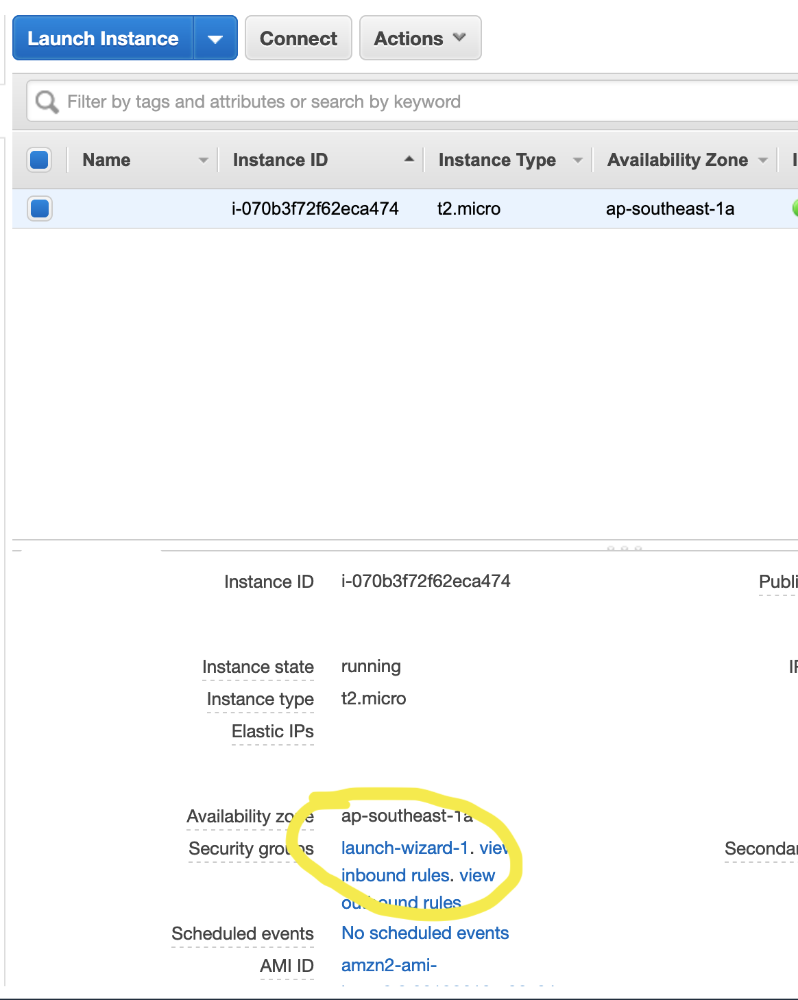
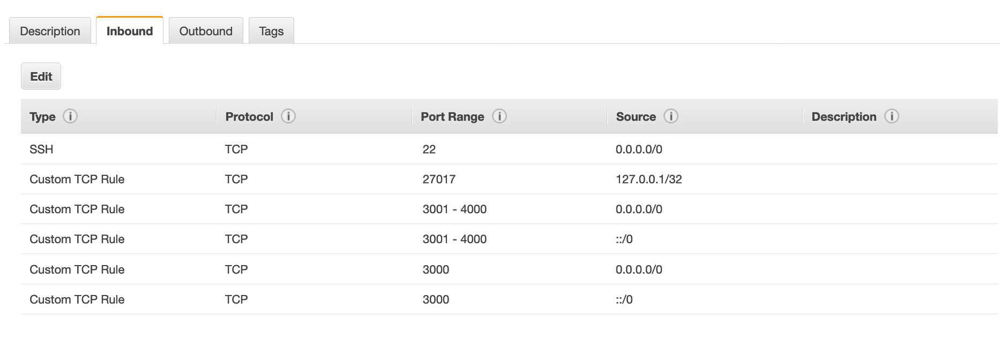

# PROJECT JETPACK  

---

**Team Members:**

* Adriana Graybill
* Lee-Roy King
* Brandyn Vay
* Elizabeth Kavalski

---

## BEAM ME UP

  Beam me up is an npm package that will help the user to automate the Amazon Web Services(AWS) process for the EC2(Elastic Compute Cloud) service.

---

## Documentation

* [jsdocs]()
* [npm package](https://www.npmjs.com/package/@project-jetpack/beam-me-up)

---

## PROBLEM DOMAIN

  The problem Beam Me Up is attempting to solve is to automate the complexity of setting up and using the AWS EC2 service.
  
---

## SOLUTION

To solve automating the AWS EC2 we are implemting everything in to an npm package. So that the user will be able to require in the package and use our software to solve there AWS problem. Beam Me Up will also use prompts in the terminal, so when the user runs the npm package.The prompt will ask for the following:

* Github Repo url link
* Dot ENV file (if they want to use there own)
  * Dot ENV File path (if they answered yes to the above)

If the user gives Beam Me Up the file path to there env file. It will then take the users port number and use its own. The npm package will then parse through the repo, and env file.
  
Then Beam Me Up will create a pem key(a public–key to encrypt and decrypt login information) pair to use. With all the info that the user gave the package, it will then create an EC2 instance and parse through the data of the instance to return a public DNS name.

The Public DNS name is then inputed into the super agent(a progressive ajax API) call for the prompt. Superagent then sends a post request to the server.

Then <span style="color:red">*Beam Me Up Scotty!!*</span>

---

## Libraries

* Node.js
* aws-sdk
* inquirer
* pm2
* jest
* dotenv

---

## Modules

* `ec2_createinstances.js`
* `parseinstance.js`
* `terminateinstance.js`
* `leednsattempt.js`

---

## Running The App

#### Requirements
  - AWS account
  - node/npm installed locally
  - github repo with an express server


#### Getting started 
In this section we will 
- Created an IAM user that our software can interact with your AWS account through
- Pulled that credential pair down to your local machine
- Cloned down the repo locally
- Installed dependancies
- Launched an EC2 Cloud server
- Configured security groups so that the service would be reachable

#### Step by step instructions
  - open AWS account
  - Create an IAM user for programmatic access (the aws-sdk will pull creds from your local computer)
  - leave that window open while you run aws configure from your local development command line
  - from local shell type 
  ```
  aws configure
  ```
  - you will see the following prompt
  ```
AWS Access Key ID [****************ESHN]: 
AWS Secret Access Key [****************Em9v]: 
Default region name [us-west-2]: 
Default output format [text]: 
```
  - enter your access key when prompted and same for your secret access key
  - region should be us-west-2 for this demo
  - clone down this repo locally 
  ```
  git clone https://github.com/401-midterms-kramer/beam-me-up
  ```
  - cd into the directory 
  ```
  cd beam_me_up
  ```
  - run an npm i
  ```
  npm install
  ```
  - **TECH DEBT** make sure the terminate line in app.js is commented out (line 16 app.js)
  - run the node command to create a server from our pre-formatted ami[^1]
  ```
node app.js
  ```
  - **TECH DEBT** this may return a DNS name or it may not no biggie
  - Go back to the AWS EC2 console and select the newly launching instance
  - Click the instances checkbox
  - Click on the security group settings (**launch-wizard-1** in this case)
  
  - Click on inbound rules
  - Modify the instances security group rules to match these (port 22 rule is optional)


  - Now you are ready to interact with the service!

#### Interacting with the service

- After completing above getting set up steps
- **TECH DEBT** run 
```
node promt-commands/prompt-inquirer/prompt-inquirer.js 
```
- This will prompt you for a github repo the proper syntax for this entry is[^2]
```
https://github.com/401-midterms-kramer/demo-1
```
- support for .env files right now requires the .env file to be in the same folder from where you run the node command above (path to the command will be different if you are not running it from the root directory of the repo)

- after a short wait you will get back a link to your live site!
- thats it, you have a live website

[^1]: This project uses basic authentication to validate permission against the server. The intention was to make this very easy to interact with for the end user, as a result the code for this repository has credentials hard coded. We ran out of time to automate short term credentials on this project and left a default user with username:password combo of lee:lee. We are well aware of how bad that is.

[^2]: Feel free to fork our example for static websites!

## Testing

In the terminal use npm test, to start your testing.
